# Syntax

This page is a complete grammar reference for SAIL. Every grammar rule appears
as its own section, followed by a railroad diagram. Rounded boxes denote
terminal tokens (keywords and punctuation); rectangular boxes denote
non-terminals and link to the corresponding rule. The notation follows standard
EBNF conventions: `[ … ]` marks optional elements and `{ … }` marks
zero-or-more repetition.

---

## Parser Rules

### CompilationUnit

A SAIL source file consists of an optional sequence of import declarations
followed by a sequence of top-level declarations.

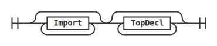

---

### TopDecl

A top-level declaration is one of: a contract, a free function, a type class,
an instance, an algebraic data type, a type synonym, an export declaration, or
a pragma.

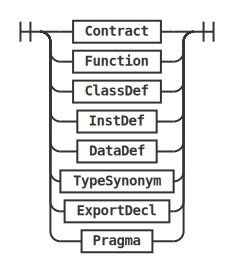

---

### Import

An import declaration makes names from another module available in the current
module. The `@package.` prefix selects an external package; the `lib.` prefix
selects a standard library module.

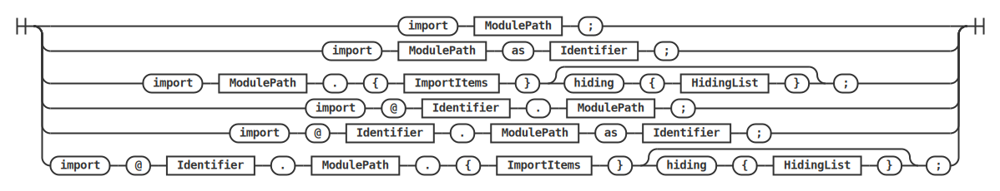

---

### ModulePath

A module path is a dot-separated sequence of identifiers that locates a module
within a package.

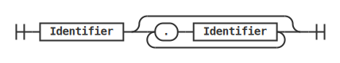

---

### ImportItems

The list of names to import from a module, enclosed in braces.

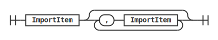

---

### ImportItem

A single item to import: either a specific identifier or the wildcard `*` which
imports all exported names.

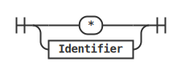

---

### HidingList

A comma-separated list of names to exclude from an import.

---

### ExportDecl

An export declaration controls which names this module exposes to other modules.

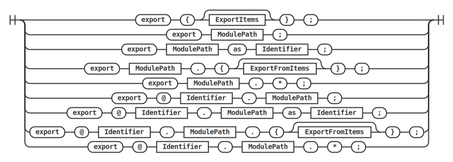

---

### ExportItems

The list of names to export from the current module, enclosed in braces.

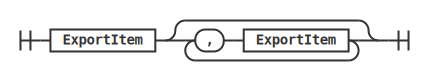

---

### ExportItem

A single export entry: the wildcard `*`, a plain name, a name together with its
constructors, or all names from a module.

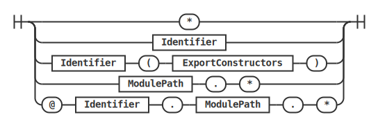

---

### ExportConstructors

Selects which data constructors to re-export alongside a type name: either all
constructors (`*`) or an explicit list.

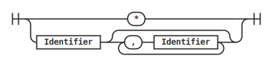

---

### ExportFromItems

The list of names re-exported from another module.

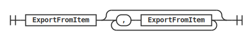

---

### ExportFromItem

A single entry in a re-export list: the wildcard `*`, a plain name, or a name
with explicit constructor re-exports.

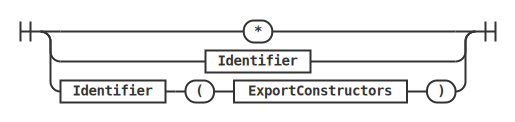

---

### Pragma

A pragma adjusts compiler behaviour for type class constraint checking. Without
targets the pragma applies to all classes; with a list of identifiers it applies
only to those specific classes.

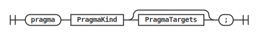

---

### PragmaKind

The three available pragma kinds relax, respectively, the coverage condition,
the Patterson condition, and the bound-variable condition for type class
instance resolution.

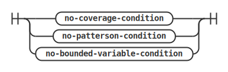

---

### PragmaTargets

A comma-separated list of class names to which a pragma applies.

---

### Type

A type is one of: a named type constructor applied to zero or more type
arguments, a function type of the form `(T₁, …, Tₙ) -> T`, a tuple or unit
type written as a parenthesised comma-separated list, or a proxy type `@T`.

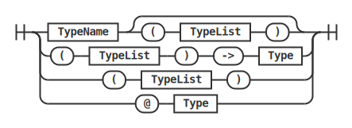

---

### TypeList

A comma-separated (possibly empty) list of types, used as arguments to type
constructors and as the parameter list of function types.

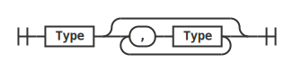

---

### TypeVarSeq

A space-separated sequence of type-variable names following a `forall` keyword.
All listed names are universally quantified over the scope of the accompanying
signature.

---

### TypeVarParams

A comma-separated list of type-variable names enclosed in parentheses. Used in
`data`, `type`, and `class` declarations to introduce parametric type
arguments.

---

### TypeName

A possibly qualified type name. Simple names are single identifiers; qualified
names chain module components with `.`.

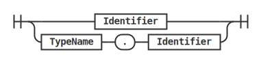

---

### DataDef

An algebraic data type declaration. The optional parameter list introduces
type variables. The optional body lists the constructors separated by `|`.

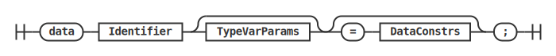

---

### DataConstrs

One or more data constructor definitions separated by `|`.

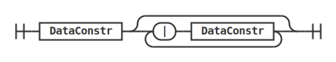

---

### DataConstr

A single data constructor: a name optionally followed by a
parenthesised, comma-separated list of field types.

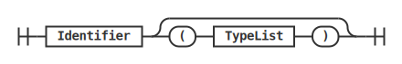

---

### TypeSynonym

A type synonym introduces an alias for an existing type. The optional parameter
list introduces type variables that may appear in the right-hand side.

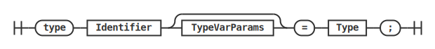

---

### Pattern

A pattern appears in `match` equations to deconstruct a value by its
constructor. The dot-prefix form (`.Name`) is a contextual shorthand: the
constructor is resolved from the type being matched.

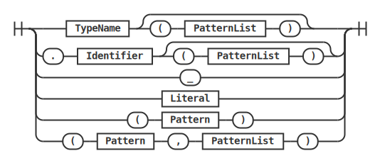

---

### PatternList

A comma-separated list of patterns used as the argument list of a constructor
pattern or as the simultaneous arguments of a `match` equation.

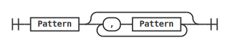

---

### Expr

An expression computes a value. Binary operators follow standard precedence:
arithmetic binds tighter than comparison, which binds tighter than logical. All
binary operators are left-associative except `if-then-else`, which is
right-associative.

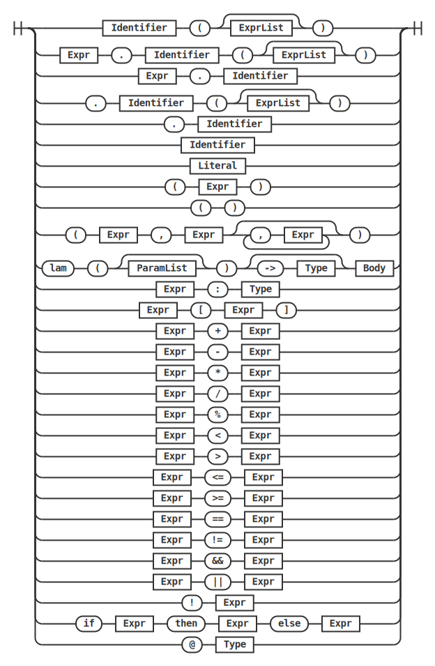

---

### ExprList

A comma-separated (possibly empty) list of expressions used as function
arguments.

---

### Literal

A literal value: a decimal or hexadecimal integer, or a double-quoted string.

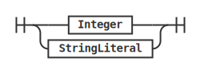

---

### Stmt

A statement is an executable step inside a function body. Assignment operators
`=`, `+=`, and `-=` require a terminating `;`. `let` declares a local variable,
optionally with a type annotation and an initialiser.

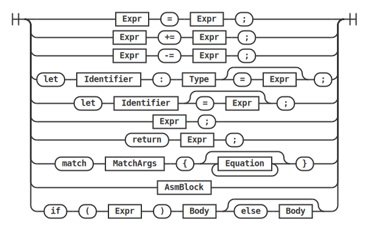

---

### Body

A brace-enclosed sequence of zero or more statements forming the body of a
function, branch, or constructor.

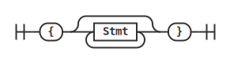

---

### MatchArgs

One or more comma-separated expressions forming the scrutinees of a `match`
statement.

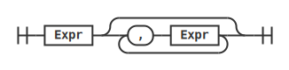

---

### Equation

A single match arm: a `|`-prefixed list of patterns followed by `=>` and a
sequence of statements. The patterns are matched positionally against the
scrutinee list.

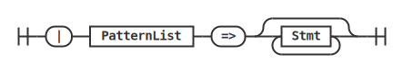

---

### Param

A single function parameter: a name with an explicit type annotation, or an
untyped name whose type will be inferred.

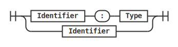

---

### ParamList

A comma-separated list of function parameters.

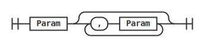

---

### Function

A function definition. The long form uses a brace-enclosed statement block as
the body. The short form uses a single expression whose value is returned
implicitly (Rust-style).

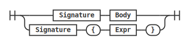

---

### Signature

A function signature declares the function name, its parameter list, and the
optional return type. It may be preceded by a polymorphism prefix to introduce
type variables and constraints.

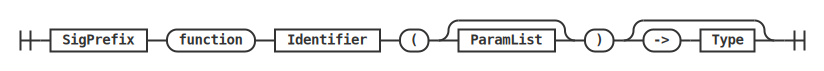

---

### SigPrefix

An optional `forall` quantifier that precedes a function or method signature. It
introduces universally quantified type variables and, optionally, a list of type
class constraints that callers must satisfy.

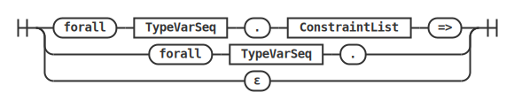

---

### ConstraintList

A comma-separated list of type class constraints.

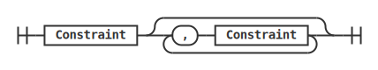

---

### Constraint

A single type class constraint of the form `Type : ClassName` or
`Type : ClassName(T₁, …, Tₙ)`. It asserts that the given type is an instance
of the named class, possibly with additional type parameters.

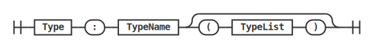

---

### ClassDef

A type class declaration. The self-variable (the first identifier after
`class`) is the main type being constrained. The optional comma-separated list
in parentheses introduces auxiliary associated type variables. The body lists
method signatures, each terminated by `;`.

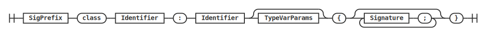

---

### InstDef

An instance declaration provides method implementations for a specific type.
The optional `default` keyword marks the instance as an overlappable fallback
when no more specific instance is found.

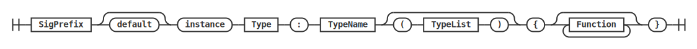

---

### Contract

A contract groups fields, nested data types, methods, and an optional
constructor. The optional parameter list makes the contract generic over type
variables.

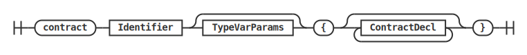

---

### ContractDecl

A single declaration inside a contract body: a field, a data type, a function,
or a constructor.

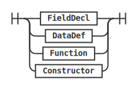

---

### FieldDecl

A contract field declaration. The type annotation is mandatory; the initialiser
expression is optional.

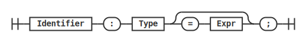

---

### Constructor

A contract constructor is invoked exactly once at deployment time. It has an
explicit parameter list and a statement block body.

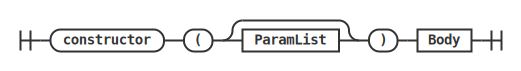

---

### AsmBlock

An inline assembly block embeds Yul statements directly in SAIL source code,
giving direct access to EVM opcodes.

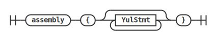

---

### YulStmt

A statement in the Yul sublanguage. Yul provides low-level control flow (`if`,
`switch`, `for`, `break`, `continue`, `leave`) and variable declarations and
assignments using `:=`.

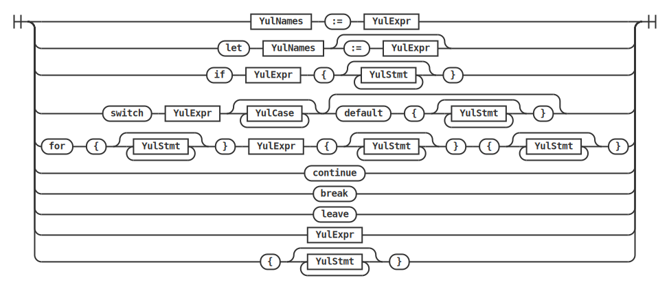

---

### YulCase

A single `case` arm in a Yul `switch` statement: a literal value followed by a
block of Yul statements.

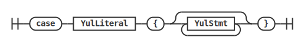

---

### YulExpr

A Yul expression: a literal, a variable reference, a function call, or a call
to the special `return` built-in.

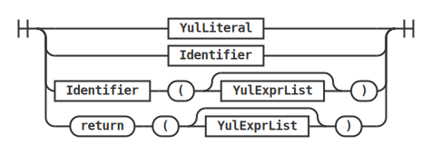

---

### YulNames

A comma-separated list of identifiers used as the left-hand side of a Yul
multi-assignment or the names in a Yul `let` declaration.

---

### YulExprList

A comma-separated list of Yul expressions used as arguments to a Yul function
call.

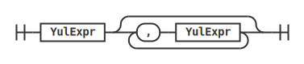

---

### YulLiteral

A Yul literal value: a decimal or hexadecimal integer, or a string.

---

## Lexer Rules

### Identifier

An identifier begins with a letter (upper or lower case) and may contain
letters, decimal digits, and underscores. Identifiers are used for variable
names, function names, type names, module components, and constructor names.

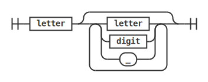

---

### Integer

An integer literal is either a sequence of decimal digits or a hexadecimal
literal prefixed with `0x`.

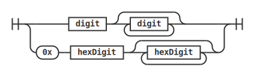

---

### StringLiteral

A string literal is a sequence of characters enclosed in double quotes.
Supported escape sequences are `\n` (newline), `\t` (tab), and `\"` (literal
double quote).

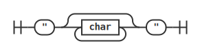
